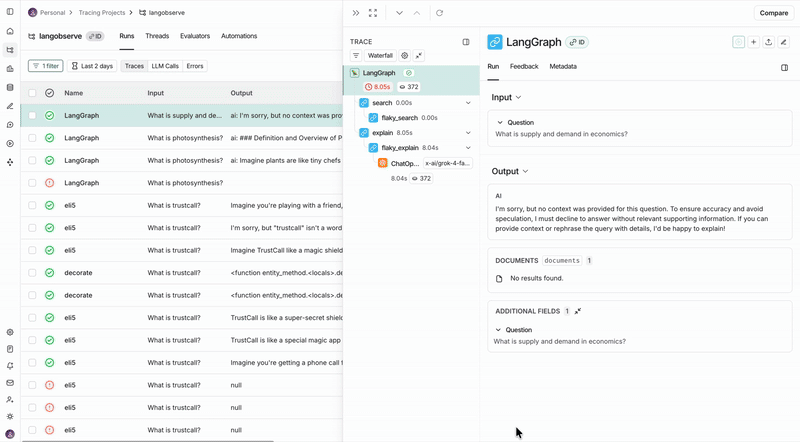

# LangGraph + Multi-Backend Observability Example

A practical example showing how to add observability to LangGraph applications using multiple tracing backends - both free and paid options.

This demo builds a simple "Explain Like I'm 5" (ELI5) application that searches the web and generates simple explanations. It includes three versions:
- **Working**: Correctly implements simple explanations
- **Buggy**: Uses wrong prompt (technical instead of simple)
- **Flaky**: Fails inconsistently for economics questions

## Why Multiple Observability Backends?

You can use both LangSmith and Langfuse simultaneously to get:
- Cross-validation of metrics
- Different UI/UX for different team members
- Redundancy if one service is down
- Free tier of both services for small projects

## Quick Start

### Install Dependencies
```bash
pip install langchain langchain-openai langchain-tavily langgraph langfuse langsmith python-dotenv


